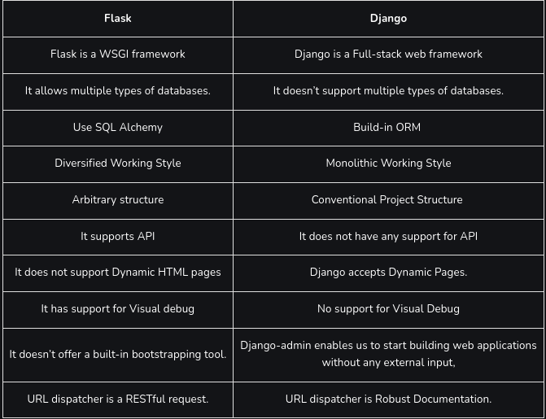
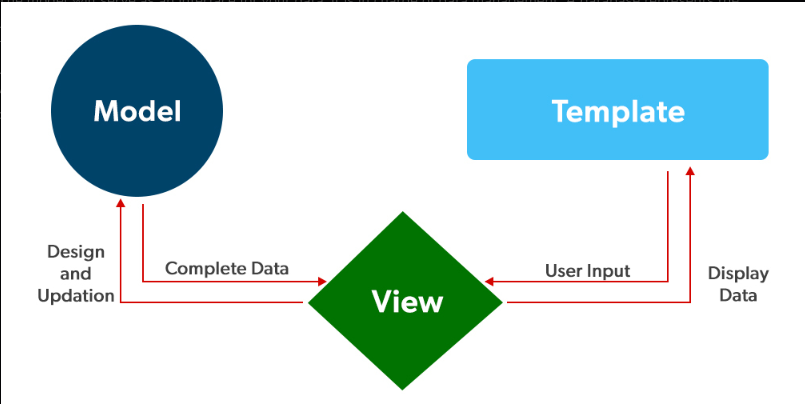

1) What is Django?

Django is a Full-stack web development framework that facilitates the creation and maintenance of high-quality Dynamic pages while also encouraging rapid development and a clean, pragmatic style. Django makes it easier to automate repeated operations, resulting in a more efficient development process with fewer lines of code. 

2) What is the difference between Flask and Django?

3) Name some Companies that use Django.

Some companies that use the Django framework are Instagram, Mozilla, Disqus, Bitbucket, Nextdoor, and Clubhouse.

4) What is the difference between a Project and an App?

The main difference between a project and an app is that a project is defined as the entire application whereas, an app is part of the project that is self-sufficient to perform any task.

5) Explain Django’s architecture.

The Model-View-Template also known as MVT architecture is used by Django. It is a software design pattern for developing a web application.

 The Django MVT Structure is made up of three parts:

(*) The model will serve as an interface for your data. It is in charge of data management. A database represents the logical data structure that supports the entire application such as MySql and Postgres.
(*) The View is the user interface, that renders a website page in your browser. HTML/CSS/Javascript and Jinja files are used to represent it.
(*) A template is made up of both static sections of the desired HTML output and specific syntax that describes how dynamic content will be included.

6) What are the Features of using Django?

*) Flexible server arrangement, 
*) Model relation database 
*) Provide object-relational mapper
*) Web templating system
*) Middleware class support
*) Regex-based URL Dispatcher
*) Unit testing framework
*) Admin Interface
*) Django is SEO optimized.
*) In-build mitigation 
*) Easy inheritance

7) Explain the Django project directory structure.

When you first start a Django project, it comes with some basic files like manage.py and view.py.

1) init.py – It’s an empty Python file. It is called when the package or one of its modules is imported. This file tells the Python interpreter that this directory is a package and that the presence of the __init.py_ file makes it a Python project.

2) manage.py – This file is used to interact with your project from the command line utility. with the help of this command, we can manage several commands such as: 

            1) manage.py runserver
            2) manage.py makemigration
            3) manage.py migrate

3) setting.py – It is the most important file in Django projects. It holds all the configuration values that your web app needs to work, i.e. pre-installed, apps, middleware, default database, API keys, and a bunch of other stuff. 

4) views.py – The View shows the user the model’s data. The view knows how to get to the data in the model, but it has no idea what that data represents or what the user may do with it.

5) urls.py – It is a universal resource locator which contains all the endpoints, we store all links of the project and functions to call it.

6) models.py – The Model represents the models of web applications in the form of classes, it contains no logic that describes how to present the data to a user.

7) wsgi.py – WSGI stands for Web Server Gateway Interface, This file is used for deploying the project in WSGI. It helps communication between your Django application and the web server.

8) admin.py – It is used to create a superuser Registering model, login, and use the web application.

9) app.py – It is a file that helps the user to include the application configuration for their app.